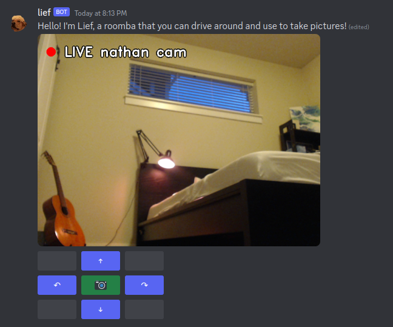
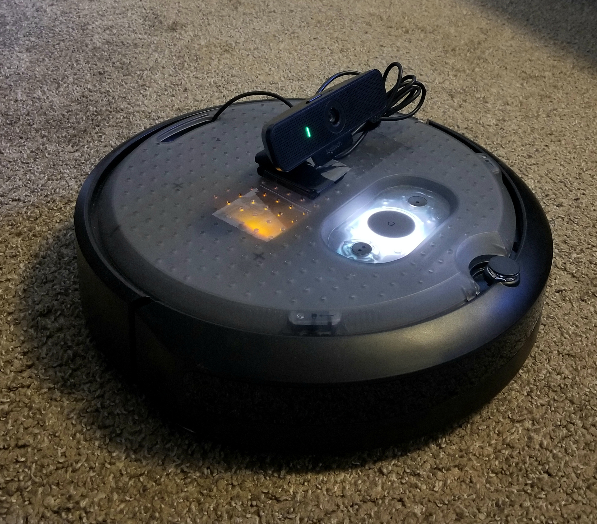

# lief

Lief is the name of my iRobot Create 3 robot, a Roomba sans vacuum.
This codebase contains a Discord bot integration that allows my friends to control Lief in real-time from anywhere in the world.

Using a Discord bot, users can access a UI to move and take pictures using the robot.
It's a bit disorienting, but works, honestly, much better than I expected.

 

# requirements
Tested using ROS 2 Humble, discord.py version 2.2.2, opencv-python version 4.7.0, Create 3 firmware version H.0.0.

Sure would be swell if I'd write a pip requirements.txt, too.

# setup
Hi future me-- here's how I set up this goofball.

## discord bot
Go to the [Discord developers page](https://discord.com/developers) and create a bot. Grant the "message content" intent. 

Invite the bot to your server(s) using the "bot" permissions scope. Include permissions for sending messages, managing messages, adding embeds, and uploading attachments.

Generate an auth token, and save it in plaintext at `token.txt` in this directory.

## robot setup
Configure the Create 3 with an attached compute board such as the Jetson Nano and a webcam.
Connect both the Create 3 itself and the compute board to the same network as your host machine (desktop or laptop, perhaps).
The compute board on the Create 3 will only act to push webcam frames over the network-- controls and the interface with Discord will be handled by the host machine.

SSH into the attached compute board, clone the repo, and run this, replacing `COMPUTE-BOARD-IP` with the compute board's local IP address:
```
python3 webcam_zmq.py pub COMPUTE-BOARD-IP
```

The compute board should now be publishing compressed frames to the network using zmq's pub sub architecture.

## host machine setup
Your host machine needs to have a working ROS 2 install, along with all other python requirements of this codebase.

Clone this repo.
Make sure that you followed the Discord bot steps above to create `token.txt`.

Run this, again replacing `COMPUTE-BOARD-IP` with, uh, the compute board's IP:
```
python3 bot.py COMPUTE-BOARD-IP
```

This is the meat of the bot and handles three major connections:
* Connects to Discord using discord.py, appearing as the bot account associated with the `token.txt` auth token.
* Sends command velocities to the Create 3 by spinning up a ROS 2 node.
* Receives frames from the compute board over a zmq subscription.

## jetson tomfoolery
Yay, EOL hardware!
If you get GStreamer errors, add `cv2.CAP_V4L` as an argument to the `cv2.VideoCapture` constructor in `capture.py` to force the V4L backend.

# usage
Once the bot is online, simply send the message `$robot` in the server to create an interactable UI!

The four arrow buttons move Lief forward / backward or turn left / right.
The camera button will grab the latest frame and show it in the message.
**The same image is shown to all people in the server, and all members can simultaneously issue controls.**

When done, you can send `$shutdown` or sigint the bot to close its connections.
It should automagically clean up any messages it sent to the server.

# what's the catch? (todo)
I directly import rclpy in the ROS module of this code, which is *Not Good*.
It means this can't nicely be used with virtual envs, etc.
Rather, the base python 3 install needs to have all the requirements installed alongside ROS 2.
Since there aren't a ton, this isn't a huge issue, but it would be really nice to create a proper ROS package down the line.

Some of the multiprocessing cleanup isn't exactly watertight.
If you get port binding errors, this would be a likely culprit.
